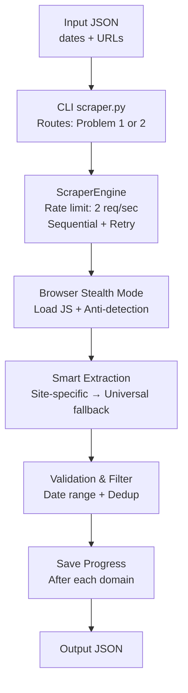

# Government Meeting Scraper

Robust web scraper for extracting meeting metadata from government websites with automatic retry, bot detection avoidance, and incremental saving.

**Key Features:** Sequential processing • Incremental saving • Automatic retry • Bot avoidance • Rate limiting • Zero false positives

---

## 📦 Setup

**Prerequisites:** Python 3.8+

**Compatible with:** Windows (Git Bash), Linux, Mac

```bash
chmod +x setup.sh
bash setup.sh
```

This installs dependencies, Playwright browser, and creates necessary directories.

The scripts automatically detect your OS and configure accordingly.

---

## 🚀 Usage

### Run All Tasks

```bash
chmod +x run.sh
bash run.sh
```

Runs Problem 1 → Problem 2 → Bonus sequentially

### Problem 1: Meeting Metadata

```bash
chmod +x run.sh
bash run.sh problem1
```

**Output:** `outputs/problem1_complete_output.json`

Scrapes 6 government websites (Nov 20, 2024 - Nov 26, 2025)

### Problem 2: URL Resolution

```bash
chmod +x run.sh
bash run.sh problem2
```

**Output:** `outputs/problem2_output.json`

Resolves and verifies 11 URLs:
- yt-dlp --simulate (videos/audio)
- HTTP HEAD (documents)
- Platform transformations (Swagit /download)

**Supported:** YouTube, IBM Video, Granicus, ChampDS, Viebit, SharePoint, Audiomack, PDF, HTML

### Bonus: Universal Scraper

```bash
chmod +x run.sh
bash run.sh bonus
```

**Output:** `outputs/bonus_output.json`

One scraper for 40 diverse sites • Auto-detect patterns • 100% accuracy (zero false positives)

### Custom Input

**Problem 1:**
```bash
python scraper.py scrape-meetings -i inputs/custom.json -o outputs/result.json
```

**Problem 2:**
```bash
python scraper.py resolve-urls -i inputs/custom_urls.json -o outputs/resolved.json
```

---

## 📋 Input/Output Formats

### Problem 1

**Input:**
```json
{
  "start_date": "2024-11-20",
  "end_date": "2025-11-26",
  "base_urls": ["https://example.gov/meetings"]
}
```

**Output:**
```json
[{
  "base_url": "https://example.gov/meetings",
  "medias": [{
    "meeting_url": "https://youtube.com/watch?v=...",
    "agenda_url": "https://example.gov/agenda.pdf",
    "minutes_url": "https://example.gov/minutes.pdf",
    "title": "City Council Meeting",
    "date": "2024-11-20"
  }]
}]
```

### Problem 2

**Input:**
```json
[
  {"url": "https://swagit.com/videos/123", "type": "audio"},
  {"url": "https://example.gov/doc.pdf", "type": "document"}
]
```

**Output:**
```json
[
  "https://swagit.com/videos/123/download",
  "https://example.gov/doc.pdf"
]
```

---

## 📁 Project Structure

```
scraping/
├── scraper.py              # CLI interface
├── setup.sh                # Installation script
├── run.sh                  # Quick run (Problem 1 & 2)
├── inputs/                 # Input JSON files
│   ├── problem1_all_domains.json
│   └── problem2_input.json
├── outputs/                # Generated outputs (incremental saves)
│   ├── problem1_complete_output.json
│   └── problem2_output.json
├── logs/                   # Application logs
└── src/
    ├── core/               # Core services
    │   ├── engine.py       # Main orchestrator
    │   ├── browser.py      # Browser management
    │   ├── stealth.py      # Anti-detection
    │   └── url_resolver.py # URL verification (Problem 2)
    ├── extractors/         # Site-specific extraction
    │   ├── base_extractor.py
    │   ├── site_handlers.py
    │   └── site_specific/  # Individual site handlers
    ├── storage/            # Data models & persistence
    │   ├── models.py
    │   ├── meeting_models.py
    │   └── writer.py
    └── utils/              # Helpers & logging
        ├── logger.py
        ├── helpers.py
        └── error_detector.py
```

---

## 🔧 Configuration

Edit `src/storage/models.py` and `src/core/url_resolver.py` for custom settings.

**Key settings:**
- Rate limit: 2 req/sec per domain
- Retries: 2-3 attempts for network errors
- Timeouts: 20-45s depending on operation

---

## 🐛 Troubleshooting

**Virtual environment not found:**
```bash
bash setup.sh
```

**Browser missing:**
```bash
playwright install chromium
```

**Python not found:**
- Windows: Install from python.org
- Linux: `sudo apt install python3 python3-pip`
- Mac: `brew install python3`

---

## 🎯 Assignment Coverage

✅ **Problem 1**: Meeting metadata scraping (6 domains)  
✅ **Problem 2**: URL resolution with retry logic (11 URLs)  
✅ **Bonus Task**: Universal scraper (40+ sites)

---

## 🏗️ Architecture & Workflow

### Core Components

**scraper.py** → **ScraperEngine** → **Browser + Extractors** → **Output (JSON)**

- **ScraperEngine**: Orchestration, retry logic, rate limiting
- **BrowserManager**: Playwright with stealth mode (anti-detection)
- **Extractors**: Site-specific handlers + Universal fallback
- **URLResolver**: Media verification with yt-dlp

### Workflow



---

**Note:** For ethical scraping of public government data only.
