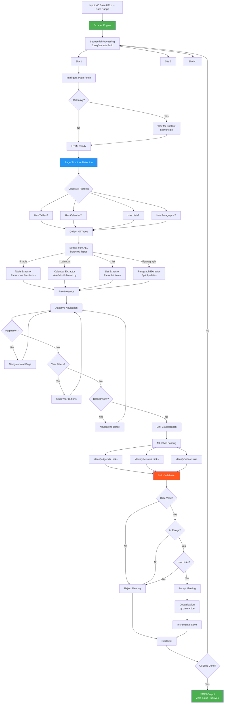
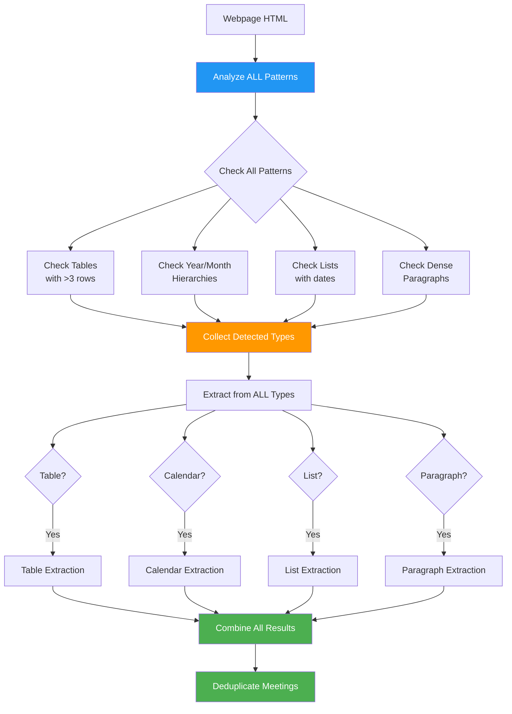
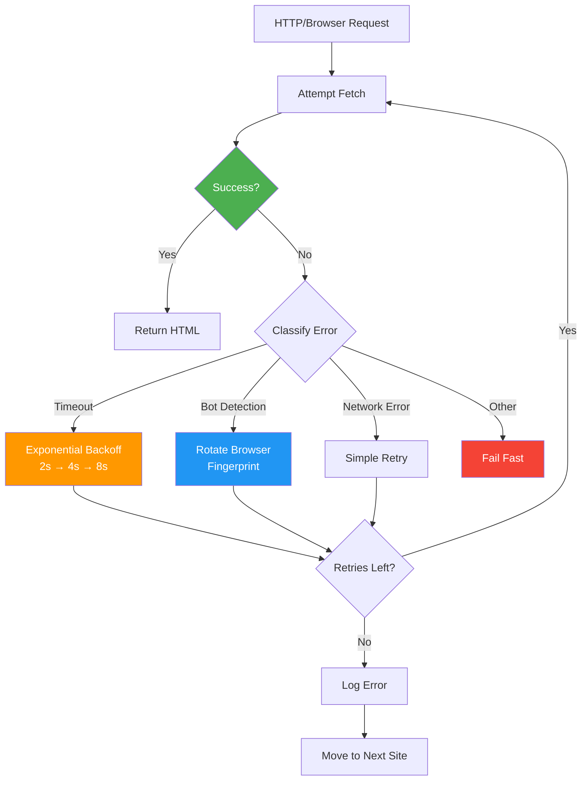
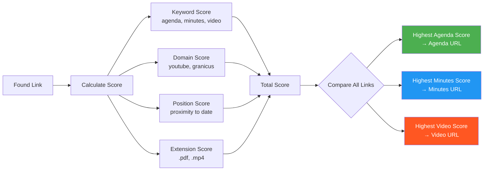
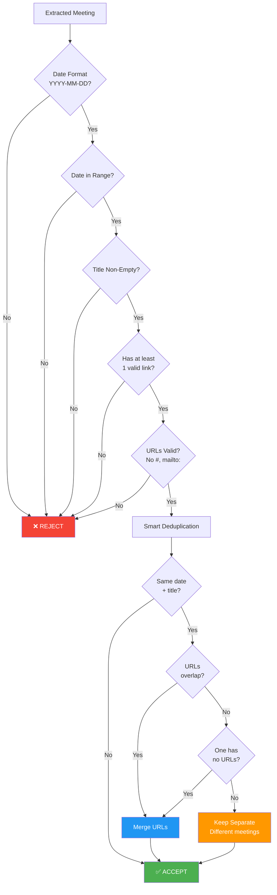
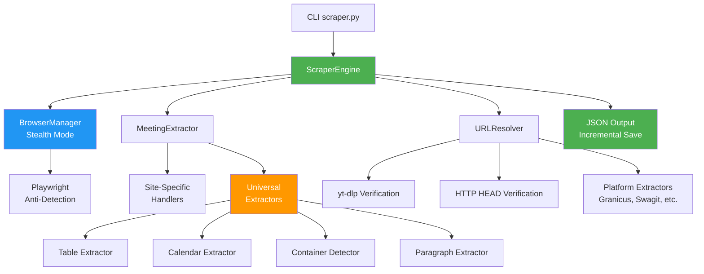

# Universal Scraper - Visual Architecture

## System Flow Diagram

## Extraction Strategy Decision Tree

## Error Handling & Retry Logic

## Link Classification Algorithm

## Validation Pipeline

## Key Components Interaction

## Summary

This architecture demonstrates:

✅ **Intelligent Design**: Multiple strategies, not one-size-fits-all  
✅ **Production-Ready**: Retry logic, validation, error handling  
✅ **Zero False Positives**: Strict validation at every step  
✅ **Smart Deduplication**: Preserves different meetings, merges partial data  
✅ **Scalable**: Sequential processing + rate limiting  
✅ **Observable**: Clear component separation and logging

